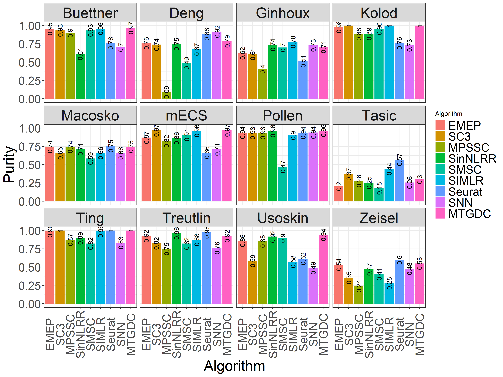
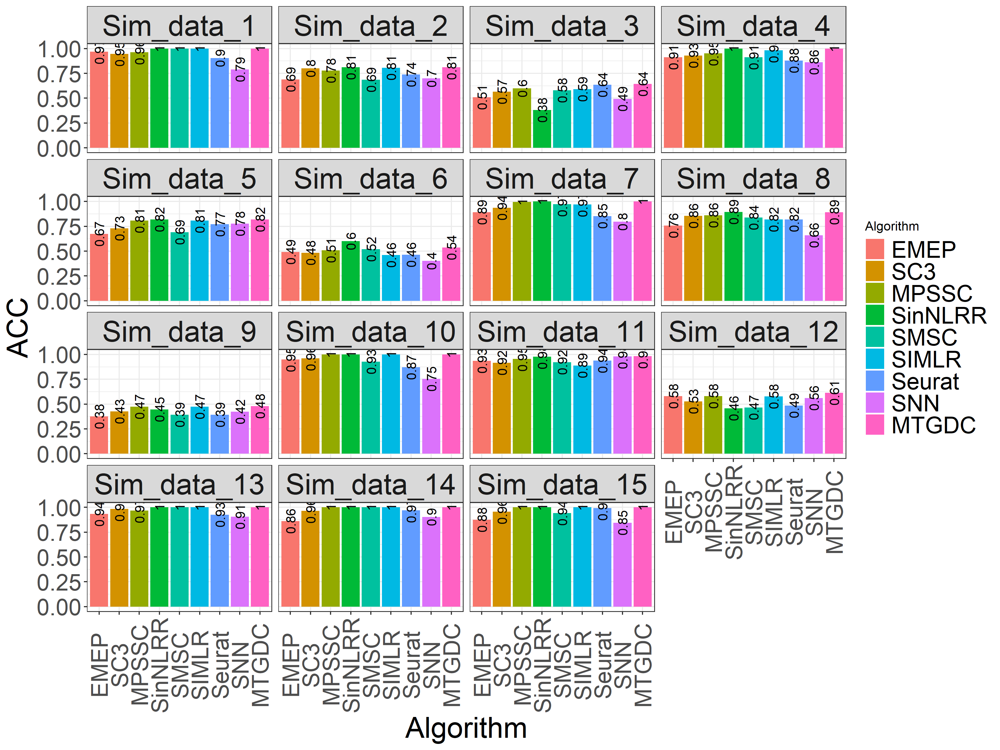

# MTGDC
===========================================================================================
> MTGDC is an unsupervised clustering framework for single-cell RNA-seq data. MTGDC can learn global topological information between cells from multiple scales and use a simple and efficient tensor diffusion update algorithm to spread the high-order cell relationship graph to its neighbors until convergence to global stable state which preserves local and global cell topology structure.To achieve the purpose of mining potential similarity distributions among cells under a large amount of noise, we design a multi-scale affinity learning method to construct a fully connected graph between cells.

## Overview


## Table of content
- [Introduction](#Introduction)
- [Installation](#Installation)
    - [Requirement](#--required-installations)
    - [Real Data](#--Real-Data)
    - [Simulated Data](#--Simulated-Data)
    - [Files  Illustration](#--Files-Illustration)
    - [Baselines](#--Baselines)
- [Example Usage](#example-usage)
    - [Preprocessing](#--Preprocessing)
    - [Multi-scale Affinity Learning](#--Multi-scale-Affinity-Learning)
    - [Tensor Graph Diffusion Learning and Mixture Operator](#--Tensor-Graph-Diffusion-Learning-and-Mixture-Operator)
    - [Spectral Clustering](#--Spectral-Clustering)
    - [Clustering Evalution](#--Clustering-Evalution)
- [Results](#Results)
    - [Scalability](#--Scalability)
    - [Implementation Time](#--Implementation-Time)
- [Acknowledgment](#Acknowledgment)
- [Maintenance](#Maintenance)

## Introduction
The algorithm has the following mechanisms: Multi-scale Affinity Learning, Tensor Graph Diffusion Learning, and Mixture Operator.

- **Multi-scale Affinity Learning**: To achieve the purpose of mining potential similarity distributions among cells under a large amount of noise, we design a multi-scale affinity learning method to construct a fully connected graph between cells.
- **Tensor Graph Diffusion Learning**: For each affinity matrix, we propose an efficient tensor graph diffusion learning framework to learn high-order in context of cells with multi-scale affinity matrices.
- **Mixture Operator**: Finally, we mix the multi-scale tensor graph together to obtain the final complete high-order affinity matrix and apply it to spectral clustering. 

## Installation
### - Required Installations
The software is coded using MATLAB and is free for academic purposes.

- MATLAB: MATLAB R2019b
- R: Seurat, splatter, ggplot2

Part of the code are from following paper:
###### Bai S, Zhou Z, Wang J, et al. Ensemble diffusion for retrieval[C]//Proceedings of the IEEE International Conference on Computer Vision. 2017: 774-783.

### - Install
To use, please download the MTGDC folder and follow the instructions

### - Real Data
We selected 12 public scRNA-seq datasets to verify the performance of clustering analysis. The data is stored as the mat format in the folder [Data](https://github.com/lqmmring/MTGDC/tree/main/Data).

- [Pollen](https://www.ncbi.nlm.nih.gov/sra?term=SRP041736)
###### 1. Pollen, A.A., et al., Low-coverage single-cell mRNA sequencing reveals cellular heterogeneity and activated signaling pathways in developing cerebral cortex. Nature biotechnology, 2014. 32(10): p. 1053.
- [Deng](https://www.ncbi.nlm.nih.gov/geo/query/acc.cgi?acc=GSE45719)
###### 2. Deng, Q., et al., Single-cell RNA-seq reveals dynamic, random monoallelic gene expression in mammalian cells. Science, 2014. 343(6167): p. 193-196.
- [Ginhoux](https://www.ncbi.nlm.nih.gov/geo/query/acc.cgi?acc=GSE60783)
###### 3. Schlitzer, A., et al., Identification of cDC1-and cDC2-committed DC progenitors reveals early lineage priming at the common DC progenitor stage in the bone marrow. Nature immunology, 2015. 16(7): p. 718.
- [Buettner](https://www.ebi.ac.uk/arrayexpress/experiments/E-MTAB-2512)
###### 4. Buettner, F., et al., Computational analysis of cell-to-cell heterogeneity in single-cell RNA-sequencing data reveals hidden subpopulations of cells. Nature biotechnology, 2015. 33(2): p. 155.
- [Ting](https://www.ncbi.nlm.nih.gov/geo/query/acc.cgi?acc=GSE51372)
###### 5. Ting, D.T., et al., Single-cell RNA sequencing identifies extracellular matrix gene expression by pancreatic circulating tumor cells. Cell reports, 2014. 8(6): p. 1905-1918.
- [Treutlin](https://www.ncbi.nlm.nih.gov/geo/query/acc.cgi?acc=GSE52583)
###### 6. Treutlein, B., et al., Reconstructing lineage hierarchies of the distal lung epithelium using single-cell RNA-seq. Nature, 2014. 509(7500): p. 371.
- [Kolod](https://www.ebi.ac.uk/arrayexpress/experiments/E-MTAB-2600/)
###### 7. Kolodziejczyk, Aleksandra A., et al., Single Cell RNA-Sequencing of Pluripotent States Unlocks Modular Transcriptional Variation. Cell Stem Cell, 2015. 17(4): p. 471-485.
- [mECS](https://www.ncbi.nlm.nih.gov/geo/query/acc.cgi?acc=GSE74535)
###### 8. Angermueller, C., et al., Parallel single-cell sequencing links transcriptional and epigenetic heterogeneity. Nature methods, 2016. 13(3): p. 229-232.
- [Usoskin](https://www.ncbi.nlm.nih.gov/geo/query/acc.cgi?acc=GSE59739)
###### 9. Usoskin, D., et al., Unbiased classification of sensory neuron types by large-scale single-cell RNA sequencing. Nature neuroscience, 2015. 18(1): p. 145-153.
- [Tasic](https://www.ncbi.nlm.nih.gov/geo/query/acc.cgi?acc=GSE71585)
###### 10. Tasic, B., et al., Adult mouse cortical cell taxonomy revealed by single cell transcriptomics. Nature neuroscience, 2016. 19(2): p. 335-346.
- [Macosko](https://www.ncbi.nlm.nih.gov/geo/query/acc.cgi?acc=GSE63473)
###### 11. Macosko, E.Z., et al., Highly parallel genome-wide expression profiling of individual cells using nanoliter droplets. Cell, 2015. 161(5): p. 1202-1214.
- [Zeisel](https://www.ncbi.nlm.nih.gov/geo/query/acc.cgi?acc=GSE60361)
###### 12. Zeisel, A., et al., Cell types in the mouse cortex and hippocampus revealed by single-cell RNA-seq. Science, 2015. 347(6226): p. 1138-1142.

### - Simulated Data
We evaluated our method on simulated datasets. Synthetic datasets were simulated by the R package [*Splatter*](https://github.com/Oshlack/splatter-paper). Thed parameters of simulated data are provided in [splatter](https://github.com/lqmmring/MTGDC/blob/main/splatter.R). 

The data is stored as the mat format in the folder [Sim-Data](https://github.com/lqmmring/MTGDC/tree/main/Data/Sim-Data) 

### - Files  Illustration
- [MTGDC](https://github.com/lqmmring/MTGDC/blob/main/MTGDC.m): main MTGDC algorithm consisting of the three steps.
- [NormalizeFea](https://github.com/lqmmring/MTGDC/blob/main/LIB/NormalizeFea.m): provide the normalized processing. 
- [adaptiveGaussian](https://github.com/lqmmring/MTGDC/blob/main/LIB/adaptiveGaussian.m): provide the multi-scale affinity learning.
- [IterativeDiffusionTPGKNN](https://github.com/lqmmring/MTGDC/blob/main/LIB/IterativeDiffusionTPGKNN.m):this code is an implementation of the diffusion process.
- [knnSparse](https://github.com/lqmmring/MTGDC/blob/main/LIB/knnSparse.m): sparse the affinity matrix by k-nearst neighbor.
- [mergeW](https://github.com/lqmmring/MTGDC/blob/main/LIB/mergeW.m): this code is an implementation of the mixture of diffusion affinity matrices.

### - Baselines
To verify the performance of our method (MTGDC), we compared it with some competitive baselines.

We selected several widely used scRNA-seq data clustering tools, including graph-based methods (Seurat and SNN-Cliq), ensemble-based methods (SC3, EMEP) and reprehensive learning-based methods (MPSSC, SIMILR, SMSC and SinNLRR). 

- Seurat-[code](https://github.com/satijalab/seurat)
###### 13. Grubman, A., et al., A single-cell atlas of entorhinal cortex from individuals with Alzheimer’s disease reveals cell-type-specific gene expression regulation. Nature neuroscience, 2019. 22(12): p. 2087-2097.
- SNN-Cliq-[code](http://bioinfo.uncc.edu/SNNCliq)
###### 14. Xu C, Su Z. Identification of cell types from single-cell transcriptomes using a novel clustering method[J]. Bioinformatics, 2015, 31(12): 1974-1980.
- SC3-[code](http://bioconductor.org/packages/SC3)
###### 15. Kiselev, V.Y., et al., SC3: consensus clustering of single-cell RNA-seq data. Nat Methods, 2017. 14(5): p. 483-486.
- EMEP-[code](https://github.com/lixt314/EMEP)
###### 16. Li, X., S. Zhang, and K.C. Wong, Single-cell RNA-seq Interpretations using Evolutionary Multiobjective Ensemble Pruning. Bioinformatics, 2018.
- MPSSC-[code](https://github.com/ishspsy/project/tree/master/MPSSC)
###### 17. Park, S. and H. Zhao, Spectral clustering based on learning similarity matrix. Bioinformatics, 2018. 34(12): p. 2069-2076.
- SIMILR-[code](https://github.com/BatzoglouLabSU/SIMLR)
###### 18. Wang, B., et al., SIMLR: A Tool for Large-Scale Genomic Analyses by Multi-Kernel Learning. Proteomics, 2018. 18(2).
- SMSC-[code](https://github.com/Cuteu/SMSC)
###### 19. Qi, R., et al., A spectral clustering with self-weighted multiple kernel learning method for single-cell RNA-seq data. Briefings in Bioinformatics, 2020.
- SinNLRR-[code](https://github.com/zrq0123/SinNLRR)
###### 20. Zheng, R., et al., SinNLRR: a robust subspace clustering method for cell type detection by nonnegative and low rank representation. Bioinformatics, 2019.

## Example Usage:
A demo is provided in [run](https://github.com/lqmmring/MTGDC/blob/main/run.m) file, showing details of data preprocessing, and clustering with MTGDC. 

### - Preprocessing 
The input is configured as n cells (rows) by m genes (columns).
```matlab
clc;
clear;
close all;
addpath('MeasureTools');
addpath('LIB');
% compile_func(0);
load('Data/Data_Marques_log.mat'); % load data
% ncell=5000;
X=in_X;
% ViewN = 3;
k = 20;
label=true_labs;
% X=in_X(1:ncell,:);
ViewN = 3;
[m,n]=size(X);
% pr=0.05;
% k = round(m*pr);
% label=true_labs(1:ncell);

kmeansK = length(unique(label));
TotalSampleNo=length(label);
TempvData=X;
NorTempvData=NormalizeFea(double(TempvData));
[tempN,tempD] = size(TempvData);
```

### - Multi scale Affinity Learning
```matlab
tic
disp('Affinity learning......');
[W_G,W_KNN] = adaptiveGaussian(NorTempvData, k, ViewN);
toc
```

### - Tensor Graph Diffusion Learning and Mixture Operator
```matlab
tic
WW_G=IterativeDiffusionTPGKNN(W_G,k, ViewN);
WW_KNN=IterativeDiffusionTPGKNN(W_KNN,k, ViewN);
WW_MerG=mergeW(WW_G,TotalSampleNo,ViewN);
WW_MerKNN=mergeW(WW_KNN,TotalSampleNo,ViewN);
toc
```

### - Spectral Clustering
```matlab
tic
disp('Spectral clustering......');
out_G = SpectralClustering(WW_MerG,kmeansK);
out_KNN = SpectralClustering(WW_MerKNN,kmeansK);
toc
```

### - Clustering Evalution
```matlab
tic
[result_G,Con_G] = ClusteringMeasure(label, out_G');  % [8: ACC MIhat Purity ARI F-score Precision Recall Contingency];
[result_KNN,Con_KNN] = ClusteringMeasure(label, out_KNN'); 
nmi_G = Cal_NMI(label, out_G');
nmi_KNN = Cal_NMI(label, out_KNN');
RES_G = [result_G,nmi_G];
RES_KNN=[result_KNN,nmi_KNN];
toc
```

## Results

### - Scalability








<figure class="half">
    
</figure>


### - Implementation Time


## Acknowledgment

The authors would like to appreciate the support and guidance from Dr. G.H. Wang and Dr. J. Li. 

## Maintenance

If there's any questions / problems about MTGDC, please feel free to contact Q.M. Liu - cslqm@hit.edu.cn. Thank you!
